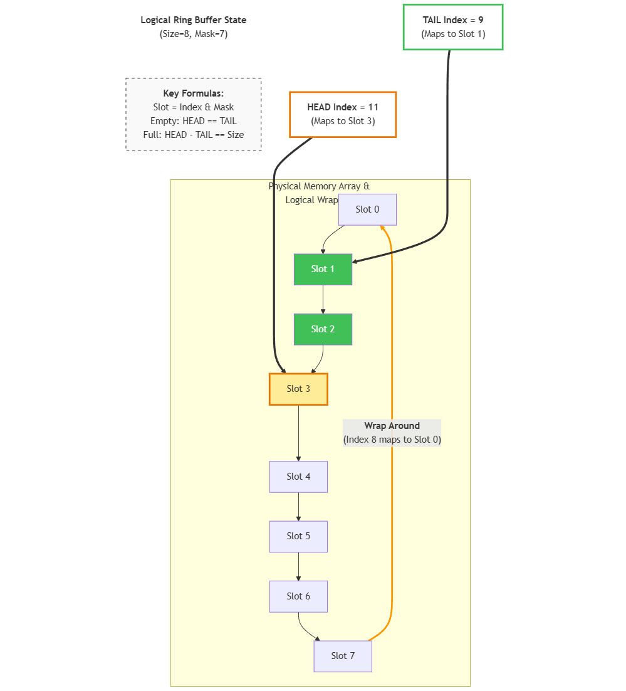

## Design: Lock‑Free SPSC Ring Buffer (Lamport)

### 1) Machine view (modern CPU + cache coherency)

- **Producer owns `head`** (only producer writes it), **consumer owns `tail`** (only consumer writes it).
- `head` and `tail` are **separated onto different 64‑byte cache lines** with padding to prevent **false sharing** and cache-line ping‑pong.

### 2) Ring buffer view (data structure + pointer movement)

- **Logical counters**: `head` = next write index, `tail` = next read index
- **Empty**: `head == tail`
- **Full**: `head - tail == size`
- **Fast wrap** (size is power of 2): `slot = index & (size - 1)`

### 3) Publication protocol (why atomics are ordered this way)
- **Push**
  - write: `buf[head&mask] = val`
  - publish: atomic store `head = head+1`
- **Pop**
  - observe: atomic load `head` to ensure data exists
  - read: `val = buf[tail&mask]`
  - free: atomic store `tail = tail+1`

### 4) Safety invariants (what must never break)
- **No underflow**: `tail <= head`
- **No overflow**: `head - tail <= size`

(Checked via TLC model checking in `RingBuffer.tla` under a finite bound.)