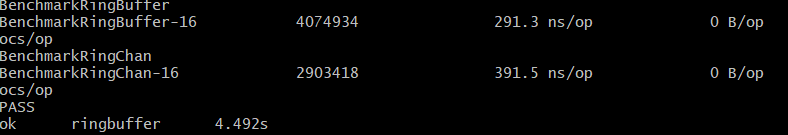
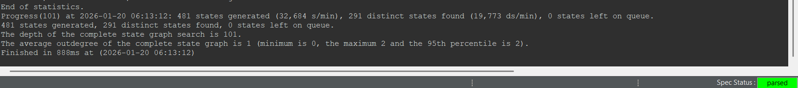

# LOCK-FREE SPSC (single-producer single-consumer) RING BUFFER 

This project came into mind after I built a distributed KV-Store from scratch and investigated if instances could have lower latencies when the overhead of Go channels is removed.
This solution uses atomic primitives and cache-line padding to successfully outperform the standard channels by ~25%. ';)'


## Core Features

* **LOCK-FREE / WAIT-FREE:** Uses `sync/atomic` with Release/Acquire semantics. removing all mutexes and syscalls.
* **Hardware Optimized:** An explicit 56-byte padding prevents False Sharing between the Head and Tail pointers on L1 cache lines `(Referenced from Algorithms for Modern Hardware by Sergey Slotin)`.
* **Formally Verified:** The safety from overflow and underflow was verified correctly using TLA+.

## Performance Benchmarks

Benchmarked on an AMD Ryzen 7 6800H (16 cores).

| Implementation | Ops/sec | Latency |
| :--- | :--- | :--- |
| **RingBuffer (This)** | ~4.0M | **291.3 ns/op** |
| Standard Go Channel | ~2.9M | **391.5 ns/op** |

**Result:** ~25% lower latency.




## Formal Verification (TLA+)

Unit tests are very inefficient when trying to catch concurrency bugs. Thus I modeled the producer/consumer logic in Leslie Lamport's **TLA+** and **mathematically proved (for the bounded model, `Head < 50`)** with TLC that:
1. `Head` never laps `Tail` (Overflow safety)
2. `Tail` never passes `Head` (Underflow safety).

The model explored 291 distinct states and found a total of **0** invariant violations. (model checked under a bound `Head < 50`)



<details>
  <summary><b>Complete Console Output</b></summary>

```
TLC2 Version 2.20 of Day Month 20?? (rev: 77dedca)
Running breadth-first search Model-Checking with fp 115 and seed 6649823007274871289 with 8 workers on 16 cores with 1154MB heap and 2595MB offheap memory [pid: 62968] (Windows 11 10.0 amd64, Eclipse Adoptium 17.0.17 x86_64, OffHeapDiskFPSet, DiskStateQueue).
Starting SANY...
Parsing file C:\Users\faila\Downloads\PROJECT 33\ringBuffer\RingBuffer.toolbox\Model_2\MC.tla
Parsing file C:\Users\faila\Downloads\PROJECT 33\ringBuffer\RingBuffer.toolbox\Model_2\RingBuffer.tla
Parsing file C:\Tools\toolbox\plugins\org.lamport.tlatools_1.0.0.202601172318\tla2sany\StandardModules\TLC.tla
Parsing file C:\Tools\toolbox\plugins\org.lamport.tlatools_1.0.0.202601172318\tla2sany\StandardModules\Naturals.tla
Parsing file C:\Tools\toolbox\plugins\org.lamport.tlatools_1.0.0.202601172318\tla2sany\StandardModules\Sequences.tla
Parsing file C:\Tools\toolbox\plugins\org.lamport.tlatools_1.0.0.202601172318\tla2sany\StandardModules\FiniteSets.tla
Semantic processing of module Naturals
Semantic processing of module RingBuffer
Semantic processing of module Sequences
Semantic processing of module FiniteSets
Semantic processing of module TLC
Semantic processing of module MC
Linting of module RingBuffer
Linting of module MC
SANY finished.
Starting... (2026-01-20 06:13:12)
Computing initial states...
Finished computing initial states: 1 distinct state generated at 2026-01-20 06:13:12.
Model checking completed. No error has been found.
  Estimates of the probability that TLC did not check all reachable states
  because two distinct states had the same fingerprint:
  calculated (optimistic):  val = 3.0E-15
The coverage statistics at 2026-01-20 06:13:12 (see https://explain.tlapl.us/module-coverage-statistics for how to interpret the following statistics).
<buffer line 5, col 23 to line 5, col 28 of module RingBuffer>: 1
<tail line 5, col 17 to line 5, col 20 of module RingBuffer>: 52
<head line 5, col 11 to line 5, col 14 of module RingBuffer>: 51
<Init line 15, col 1 to line 15, col 4 of module RingBuffer>: 1:1
  line 18, col 6 to line 18, col 43 of module RingBuffer: 1
  |line 18, col 15 to line 18, col 43 of module RingBuffer: 1:5
  ||line 18, col 22 to line 18, col 36 of module RingBuffer: 1
<Producer line 20, col 1 to line 20, col 8 of module RingBuffer>: 120:240
  line 21, col 6 to line 21, col 14 of module RingBuffer: 240
  |line 21, col 6 to line 21, col 9 of module RingBuffer: 291
  line 22, col 6 to line 22, col 29 of module RingBuffer: 240
  |line 22, col 6 to line 22, col 16 of module RingBuffer: 285
  |line 22, col 20 to line 22, col 29 of module RingBuffer: 285
  line 23, col 6 to line 23, col 21 of module RingBuffer: 240
  line 24, col 6 to line 24, col 31 of module RingBuffer: 240
<Consumer line 26, col 1 to line 26, col 8 of module RingBuffer>: 170:240
  line 27, col 6 to line 27, col 16 of module RingBuffer: 240
  |line 27, col 6 to line 27, col 9 of module RingBuffer: 291
  |line 27, col 13 to line 27, col 16 of module RingBuffer: 291
  line 28, col 6 to line 28, col 21 of module RingBuffer: 240
  line 29, col 6 to line 29, col 31 of module RingBuffer: 240
<TypeInvariant line 9, col 1 to line 9, col 13 of module RingBuffer>
  line 10, col 3 to line 13, col 30 of module RingBuffer: 291
End of statistics.
Progress(101) at 2026-01-20 06:13:12: 481 states generated (32,684 s/min), 291 distinct states found (19,773 ds/min), 0 states left on queue.
481 states generated, 291 distinct states found, 0 states left on queue.
The depth of the complete state graph search is 101.
The average outdegree of the complete state graph is 1 (minimum is 0, the maximum 2 and the 95th percentile is 2).
Finished in 888ms at (2026-01-20 06:13:12)
```

</details>

## Implementation Details

### False Sharing Prevention
So to prevent Cache Thrashing (Excessive, useless reloading), the struct forces pointers onto separate cache lines:

```go
type RingBuffer struct {
	head  uint64
	_     [56]byte

	tail  uint64
	_     [56]byte
}
```

### Usage

```go
rb := ringbuffer.NewRingBuffer(1024) // Size must be power of 2

// Producer
if rb.Push(12345) {
    // Success
}

// Consumer
val, ok := rb.Pop()
if ok {
    // Used val
}
```

### Running the Tests

```
go test -v -race -run . -bench . -benchmem -count=1 ./...

go test -v -race ./...

go test -bench=. -benchmem -cpu=2
```
